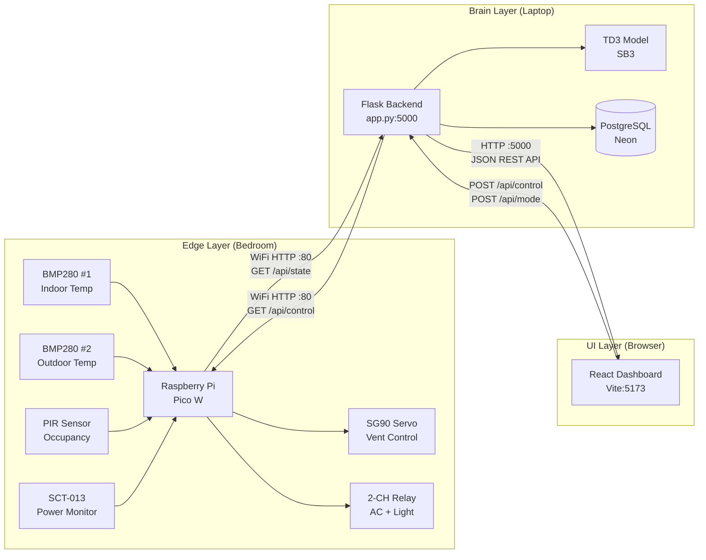

# NeuroX — Full Project Architecture

## 📁 Complete File Tree

```
neurox/
│
├── 📂 frontend/                          ← UI Layer (React + Vite + TypeScript)
│   ├── src/
│   │   ├── api/
│   │   │   └── hvacService.js            ← Legacy API utility functions
│   │   ├── components/
│   │   │   └── navigation/
│   │   │       ├── Sidebar.tsx           ← Collapsible nav sidebar
│   │   │       └── Topbar.tsx            ← Search, notifications, profile
│   │   ├── hooks/
│   │   │   ├── useAnimatedCounter.ts     ← Smooth number animation
│   │   │   ├── useDataHooks.ts           ← React Query hooks (legacy)
│   │   │   └── useLiveHardware.ts        ← ⭐ Core: polls Flask every 2s
│   │   ├── layouts/
│   │   │   └── DashboardLayout.tsx       ← Shell: Sidebar + Topbar + <Outlet/>
│   │   ├── pages/
│   │   │   ├── DashboardPage.tsx         ← Live KPIs + 5 charts
│   │   │   ├── RoomTwinPage.tsx          ← Bedroom blueprint + sensor markers
│   │   │   ├── RLEnginePage.tsx          ← State→Action→Reward flow
│   │   │   ├── HVACPage.tsx              ← ⭐ AI/Manual toggle + relay buttons
│   │   │   ├── AnalyticsPage.tsx         ← Histograms, scatter, gauges
│   │   │   ├── TrainingPage.tsx          ← Episode curves, loss tracking
│   │   │   ├── ArchitecturePage.tsx      ← System diagram
│   │   │   ├── ReportsPage.tsx           ← Session reports
│   │   │   ├── SettingsPage.tsx          ← Config panel
│   │   │   └── LoginPage.tsx             ← Auth page
│   │   ├── services/
│   │   │   └── api.ts                    ← Typed fetch wrappers
│   │   ├── store/
│   │   │   ├── simulationStore.ts        ← Zustand simulation state
│   │   │   └── themeStore.ts             ← Theme toggle
│   │   ├── types/
│   │   │   └── index.ts                  ← All TypeScript interfaces
│   │   ├── App.tsx                       ← React Router setup
│   │   ├── main.tsx                      ← Vite entry point
│   │   └── index.css                     ← Design system (CSS vars)
│   ├── index.html
│   ├── package.json                      ← 14 dependencies
│   ├── vite.config.ts
│   └── tsconfig.json
│
├── 📂 backend/                           ← Brain Layer (Flask + TD3 + PostgreSQL)
│   ├── app.py                            ← ⭐ 445 lines: all endpoints + RL inference
│   ├── models/
│   │   └── td3_hvac_agent.zip            ← 5.9 MB pre-trained model
│   ├── requirements.txt                  ← Flask, SB3, SQLAlchemy, etc.
│   └── .env                              ← DATABASE_URL (not in git)
│
├── 📂 ai_agent/                          ← Training Pipeline
│   ├── generate_csv.py                   ← Synthetic dataset generator
│   ├── hvac_env.py                       ← Custom Gymnasium HVAC environment
│   ├── train.py                          ← TD3 training script
│   ├── hvac_weather_data.csv             ← 1.7 MB (50,000 rows)
│   ├── td3_hvac_agent.zip               ← Trained model (source copy)
│   └── requirements.txt
│
├── 📂 hardware/                          ← Edge Layer (Pico W MicroPython)
│   ├── main.py                           ← Full firmware: sensors + REST API
│   └── bmp280.py                         ← I2C driver for BMP280
│
├── .gitignore
└── README.md
```

---

## 🔁 3-Tier Communication Flow



---

## 📡 API Endpoint Map

### Flask Backend (`localhost:5000`)

| Method | Endpoint | Source | Description |
|---|---|---|---|
| `GET` | `/api/live_dashboard` | `useLiveHardware.ts` | **Main loop** — reads Pico, runs TD3, returns full state |
| `POST` | `/api/control?cool=1&heat=0` | `HVACPage.tsx` | Manual relay override |
| `POST` | `/api/mode` | `HVACPage.tsx` | Switch AI ↔ MANUAL |
| `POST` | `/predict` | `hvacService.js` | Single TD3 prediction |
| `GET` | `/history` | `useDataHooks.ts` | PostgreSQL prediction log |
| `GET` | `/dashboard` | `useDataHooks.ts` | Legacy KPI summary |
| `GET` | `/rl/state` | `RLEnginePage.tsx` | Current RL state breakdown |
| `GET` | `/health` | `api.ts` | Backend health check |
| `GET` | `/dataset/summary` | `TrainingPage.tsx` | CSV dataset stats |
| `GET` | `/dataset/sample` | `TrainingPage.tsx` | Sample training rows |

### Pico W (`192.168.1.50:80`)

| Method | Endpoint | Called By | Description |
|---|---|---|---|
| `GET` | `/api/state` | `app.py` | All sensor data as JSON |
| `GET` | `/api/control?cool=1&heat=0&angle=90` | `app.py` | Set relays + servo |
| `GET` | `/api/info` | `app.py` | Device health |

---

## ⚡ Relay Control Flow

```
User clicks "Cooling ON" in HVACPage.tsx
         │
         ▼
sendCommand('control?cool=1')  ← useLiveHardware.ts
         │
         ▼
POST http://localhost:5000/api/control?cool=1  ← Flask
         │
         ▼
app.py → manual_control() → SYSTEM_MODE = "MANUAL"
         │
         ▼
GET http://192.168.1.50/api/control?cool=1  ← to Pico W
         │
         ▼
Pico main.py → set_cool_relay(1)  
         │
    Active-Low:  logical 1 → pin LOW (0) → relay ENERGIZED → AC turns ON ✅
         │
         ▼
Next /api/live_dashboard poll → MANUAL mode →
    returns relay_cool from ACTUAL hardware state (not AI computed)
         │
         ▼
Frontend reads relay_cool: 1 → button shows ON ✅
```

---

## 🧠 TD3 Decision Pipeline

```
Every 2 seconds (via /api/live_dashboard):

1. GET /api/state from Pico
   → { temperature: 28.5, temperature_2: 34.1, occupancy: 1, ... }

2. Apply presence hold filter
   → occupancy smoothed (5-min timeout after last motion)

3. Rule check: temp > 25°C?
   → YES: force cool=1, skip AI
   → NO:  continue to TD3

4. Normalize observation
   → indoor:  (28.5 - 22) / 10 = 0.65
   → outdoor: (34.0 - 25) / 15 = 0.60
   → occupancy: 1 / 3 = 0.33
   → obs = [0.65, 0.60, 0.33]

5. TD3 predict
   → action = model.predict(obs) → e.g. -0.72

6. Map action to relay
   → -0.72 < -0.15 → cool=1 (AC ON)

7. Send to Pico
   → GET /api/control?cool=1

8. Log to PostgreSQL
   → { timestamp, indoor_temp, outdoor_temp, occupancy, hvac_action }

9. Return to frontend
   → { temperature, relay_cool, rl_action, confidence, mode }
```

---

## 📊 Frontend Pages Summary

| # | Page | Key Components | Data Source |
|---|---|---|---|
| 1 | **Dashboard** | 4 KPI cards, 3 charts (temp, pressure, occupancy), power draw, RL penalty, energy savings | `/api/live_dashboard` |
| 2 | **Room Twin** | SVG bedroom blueprint, sensor markers with live labels, AC/door/window indicators | `/api/live_dashboard` |
| 3 | **RL Engine** | State→Action→Reward flow cards, decision timeline, action distribution, confidence gauge | `/rl/state` |
| 4 | **HVAC Control** | AI/Manual toggle, 3 relay cards (cooling, lighting, servo), mode indicator | `/api/control`, `/api/mode` |
| 5 | **Analytics** | 8 stat KPIs, radial gauges, temp histogram, scatter plot, duty cycle, reward decomposition, cumulative energy | `/api/live_dashboard` |
| 6 | **Training** | Episode reward curve, loss chart, hyperparams table, dataset stats | `/dataset/summary` |
| 7 | **Architecture** | System diagram, tech stack breakdown | Static |
| 8 | **Reports** | Session summary, export buttons | `/history` |
| 9 | **Settings** | Pico IP, target temp, polling interval | Local state |
| 10 | **Login** | Auth form | — |
